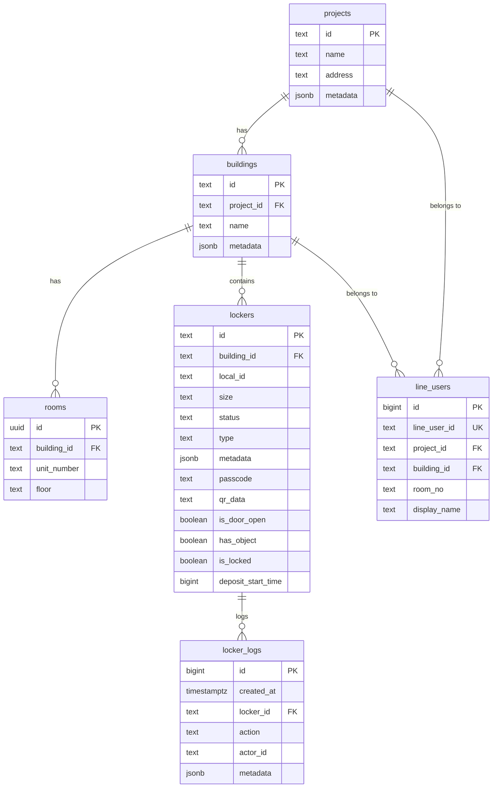
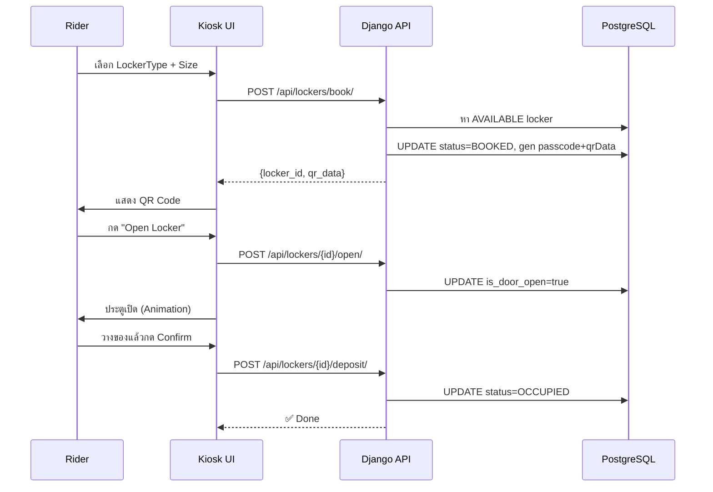
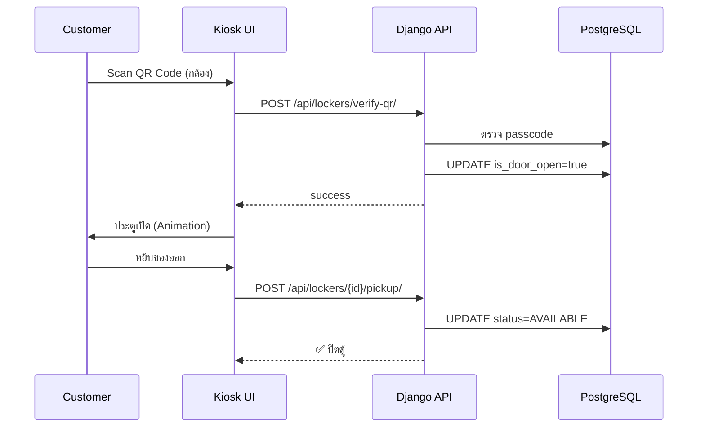
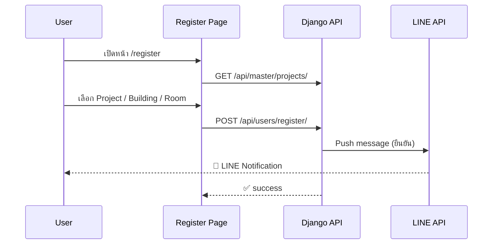
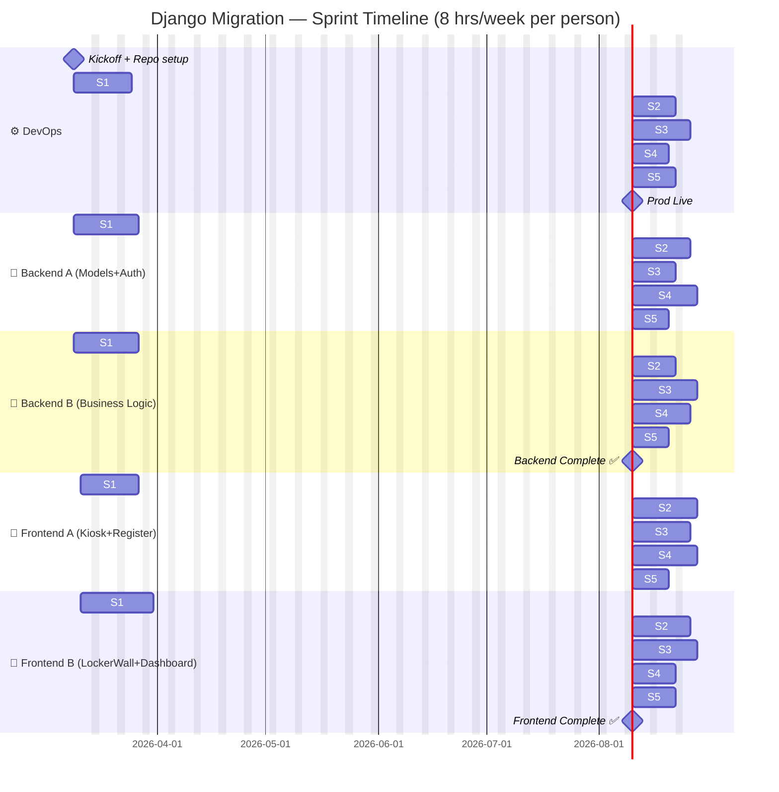
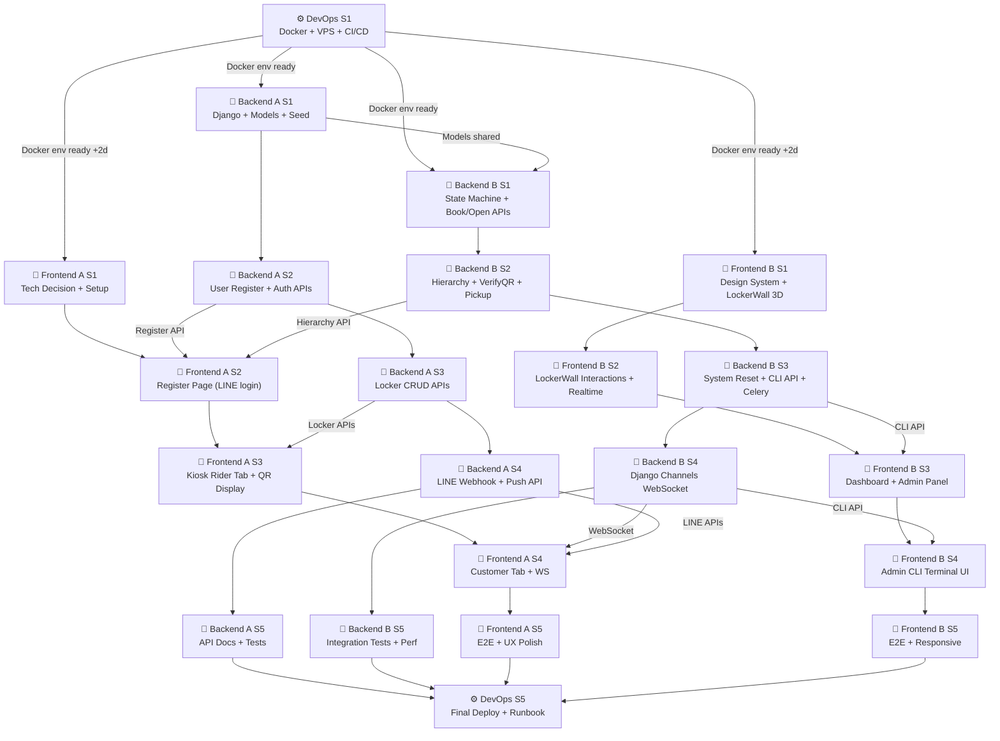

# Food Delivery Locker

### Overview

Food Box is an automated smart locker system designed to streamline the food delivery process in residential buildings. By using a secure QR and random code system, it eliminates the need for direct contact between riders and residents while ensuring food safety.

### Problem We Want to Solve
- **The "Waiting Game":** Riders and residents often waste time coordinating hand-offs.
- **Theft and Hygiene:** Food left in open areas is prone to being stolen, confused with other orders, or exposed to pests.
- **Security Issues:** Minimizes the need for external delivery personnel to wander through private building floors.

### Why We Built It
We created this system to provide a secure, traceable "middle-man" for deliveries. Unlike standard parcel lockers, this workflow is optimized for the speed and verification requirements of food delivery, providing backup solutions for technical issues and abandoned orders.

## Use Case/Scenario (Workflow)

1.  **Rider Arrival & Setup:**
    *   The rider arrives at the locker station and selects the appropriate **Locker Size** on the screen.
2.  **Code Generation:**
    *   The system generates a unique **QR Code + Random Pin Code**.
3.  **Customer Notification:**
    *   The rider takes a photo of the QR/Code on the screen and sends it to the customer via their delivery app.
4.  **Secure Deposit:**
    *   The rider confirms on the screen that the photo has been sent. The locker door opens.
    *   The rider places the food inside and takes a final "delivered" photo of the food within the locker for proof of service.
5.  **Verified Retrieval:**
    *   The resident arrives at the locker and scans the **QR Code** or enters the **Random Pin Code** to unlock the compartment.
6.  **Completion:**
    *   The resident retrieves their food and closes the locker door, resetting the locker for the next use.
    
    

## Exception Handling & Features

### Smart Access & Recovery
*   **QR/Technical Issue:** If the QR code fails to scan, a Security Guard (รปภ.) holds a **Master QR**. They can open the locker for the customer after verifying the delivery using the rider's food photo.
*   **Secure Validation:** The door only opens for the rider *after* they confirm they have sent the access credentials to the customer.

### Auto-Cleanup (Timeout Policy)
*   **Abandoned Food:** If food is not picked up within the maximum allowed time, the system triggers a timeout.
*   **Staff Intervention:** Building security or staff will be notified to remove the food and clear the locker to maintain hygiene and availability.

### Clean & Secure
*   **No Contact:** Eliminates the "lobby chaos" of food bags piled on tables.
*   **Traceability:** Every step, from deposit to pickup (including photo evidence), is recorded.

## Technology

### Smart Kiosk Interface
A centralized touchscreen where riders select locker sizes and customers input codes. It manages the logic for generating unique session-based QR codes.

### Master Access System
A secondary override system (Master QR) provided to building management to handle technical malfunctions or lost access codes.

### Photo-Verification Logic
Integrated workflow that requires "proof of photo" before and after the locker door operates, ensuring a digital paper trail for both the rider and the resident.

## Team Member & Role
- อาแฟนดี่ย์ แวอุเซ็ง 6610625037  #Team Lead & Devops #
- ณัฐรวี ช่วยวัง 6610525013 # Front-end #
- ชุติกาญจน์ กีดคำ 6610625011 # Front-end #
- ศรัญย์กร พงศ์อัศวชัย 6610545011 # Back-end #
- รัชชานนท์ ม่วงวิเชียร 6610685304 # Back-end #

# HW1
- slide: https://www.canva.com/design/DAG-G7xf0UI/oEBJj4-rOHqiSAmjnN85eQ/edit

# HW2

# Sentence Breakdown
| Subject          | Verb        | Object             | Full Sentence                                             |
| ---------------- | ----------- | ------------------ | --------------------------------------------------------- |
| Rider            | Selects     | Locker Size        | The rider selects a locker size.                          |
| Locker System    | Generates   | QR Code & Passcode | The locker system generates a QR code and a passcode.     |
| Screen           | Displays    | QR Code & Passcode | The screen displays the QR code and passcode.             |
| Rider            | Photographs | Screen             | The rider photographs the screen.                         |
| Rider            | Presses     | Confirm Button     | The rider presses the confirm button.                     |
| Locker System    | Unlocks     | Door               | The locker system unlocks the door.                       |
| Rider            | Places      | Food               | The rider places the food inside the locker.              |
| Rider            | Closes      | Door               | The rider closes the door.                                |
| Sensor           | Detects     | Door Status        | The sensor detects the door status.                       |
| Sensor           | Detects     | Object             | The sensor detects an object inside the locker.           |
| Locker System    | Updates     | Status (Occupied)  | The locker system updates the locker status to occupied.  |
| Customer         | Scans       | QR Code            | The customer scans the QR code.                           |
| Customer         | Enters      | Passcode           | The customer enters the passcode.                         |
| Locker System    | Validates   | QR Code / Passcode | The locker system validates the QR code and passcode.     |
| Admin (Security) | Scans       | Master QR          | The admin scans the master QR code.                       |
| Locker System    | Checks      | Time Duration      | The locker system checks the storage time duration.       |
| Locker System    | Alerts      | Admin              | The locker system alerts the admin when the time expires. |

# Demo System

- Main URL: https://locker-system-332.vercel.app/

Direct Links to Screens:
- Kiosk Mode: https://locker-system-332.vercel.app/kiosk
- Locker Wall: https://locker-system-332.vercel.app/locker
- Technician CLI: https://locker-system-332.vercel.app/cli

---

# Plan & Progress

##  Django Backend

> **Start:** Week 1 (Sprint 1)  
> **Duration:** 5 Sprints × 2 Weeks = ~10 Weeks (ทำงาน ~8 ชม./สัปดาห์)  
> **Team:** 1 DevOps · 2 Backend · 2 Frontend  
> **Backend Stack:** Django 5.x + DRF + PostgreSQL  
> **Frontend Stack:**  Django Templates + HTMX  | Server-side | Alpine.js

---

## 📊 Overall Progress

| Role | Sprint 1 | Sprint 2 | Sprint 3 | Sprint 4 | Sprint 5 | Total |
|------|----------|----------|----------|----------|----------|-------|
| DevOps | ⬜ 0% | ⬜ 0% | ⬜ 0% | ⬜ 0% | ⬜ 0% | **0%** |
| Backend A | ⬜ 0% | ⬜ 0% | ⬜ 0% | ⬜ 0% | ⬜ 0% | **0%** |
| Backend B | ⬜ 0% | ⬜ 0% | ⬜ 0% | ⬜ 0% | ⬜ 0% | **0%** |
| Frontend A | ✅ 100% | 🔄 15% | 🔄 75% | 🔄 33% | ⬜ 0% | **~47%** |
| Frontend B | ⬜ 0% | ⬜ 0% | ⬜ 0% | ⬜ 0% | ⬜ 0% | **0%** |
| **Overall** | | | | | | **0% / 100%** |

> ✅ Done · 🔄 In Progress · ⬜ Pending · ❌ Blocked

---

## 🗄️ ER Diagram (Database)

---

## 🔄 Sequence Diagrams

### Rider Flow (ฝากของ)

### Customer Flow (รับของ)

### LINE Registration Flow

---

## 📅 Sprint Timeline

---

## 🔀 Work Dependency / Parallel Flow

---

## 👥 Team Task Breakdown

### ⚙️ DevOps (1 คน)

| Priority | Task | Sprint | Status |
|----------|------|--------|--------|
| 🔴 P1 | [ ] `Dockerfile` สำหรับ Django (Backend) | S1 | ⬜ |
| 🔴 P1 | [ ] `docker-compose.yml` (Django + PostgreSQL + Nginx) | S1 | ⬜ |
| 🔴 P1 | [ ] ตั้งค่า VPS + SSH key + firewall | S1 | ⬜ |
| 🔴 P1 | [ ] GitHub Actions: lint → test → deploy | S1 | ⬜ |
| 🟠 P2 | [ ] Staging environment (branch: `develop`) | S2 | ⬜ |
| 🟠 P2 | [ ] Custom domain + Caddy/Nginx reverse proxy | S2 | ⬜ |
| 🟠 P2 | [ ] SSL certificate (Let's Encrypt auto-renew) | S2 | ⬜ |
| 🟠 P2 | [ ] Environment secrets (GitHub Secrets / .env) | S2 | ⬜ |
| 🟡 P3 | [ ] Monitoring (Uptime Kuma หรือ Grafana) | S3 | ⬜ |
| 🟡 P3 | [ ] Centralized logging (structlog / Sentry) | S3 | ⬜ |
| 🟡 P3 | [ ] Backup PostgreSQL daily (cron + rclone) | S3 | ⬜ |
| 🟢 P4 | [ ] Production pipeline (zero-downtime) | S4 | ⬜ |
| 🟢 P4 | [ ] Load test (k6 / locust basic) | S4 | ⬜ |
| 🔵 P5 | [ ] Runbook (deploy/rollback/db reset docs) | S5 | ⬜ |
| 🔵 P5 | [ ] Final handoff checklist | S5 | ⬜ |

---

### 🐍 Backend A — Models, Auth, Registration (คน A)

| Priority | Task | Sprint | Status |
|----------|------|--------|--------|
| 🔴 P1 | [ ] Init Django project + DRF setup + `settings.py` | S1 | ⬜ |
| 🔴 P1 | [ ] Django Models: `Project`, `Building`, `Room`, `Locker`, `LineUser`, `LockerLog` | S1 | ⬜ |
| 🔴 P1 | [ ] `manage.py migrate` + Django Admin setup | S1 | ⬜ |
| 🔴 P1 | [ ] Seed script (`seed_data` management command) | S1 | ⬜ |
| 🟠 P2 | [ ] `POST /api/users/register/` | S2 | ⬜ |
| 🟠 P2 | [ ] `GET /api/users/status/?line_user_id=` | S2 | ⬜ |
| 🟠 P2 | [ ] Authentication/Session (JWT simplejwt) | S2 | ⬜ |
| 🟠 P2 | [ ] Tests: User registration flow (pytest-django) | S2 | ⬜ |
| 🟡 P3 | [ ] `GET /api/lockers/` (list by building) | S3 | ⬜ |
| 🟡 P3 | [ ] `GET /api/lockers/{id}/` (locker detail) | S3 | ⬜ |
| 🟡 P3 | [ ] `PUT /api/lockers/{id}/` (admin update) | S3 | ⬜ |
| 🟡 P3 | [ ] Tests: Locker CRUD (pytest) | S3 | ⬜ |
| 🟢 P4 | [ ] LINE webhook: `POST /api/line/webhook/` (HMAC verify) | S4 | ⬜ |
| 🟢 P4 | [ ] LINE push: `POST /api/line/push/` (text + QR image) | S4 | ⬜ |
| 🟢 P4 | [ ] Tests: LINE webhook (mock LINE events) | S4 | ⬜ |
| 🔵 P5 | [ ] API documentation (drf-spectacular) | S5 | ⬜ |
| 🔵 P5 | [ ] Bug fixes + code review | S5 | ⬜ |

---

### 🐍 Backend B — Business Logic, Admin, Realtime (คน B)

| Priority | Task | Sprint | Status |
|----------|------|--------|--------|
| 🔴 P1 | [ ] Locker State Machine Service: `LockerService` class | S1 | ⬜ |
| 🔴 P1 | [ ] `POST /api/lockers/book/` (find + book by size/type/building) | S1 | ⬜ |
| 🔴 P1 | [ ] `POST /api/lockers/{id}/open/` (open door) | S1 | ⬜ |
| 🔴 P1 | [ ] `POST /api/lockers/{id}/deposit/` (confirm deposit) | S1 | ⬜ |
| 🟠 P2 | [ ] `GET /api/master/projects/` | S2 | ⬜ |
| 🟠 P2 | [ ] `GET /api/master/buildings/?project_id=` | S2 | ⬜ |
| 🟠 P2 | [ ] `GET /api/master/rooms/?building_id=` | S2 | ⬜ |
| 🟠 P2 | [ ] `POST /api/lockers/verify-qr/` (scan QR + passcode check) | S2 | ⬜ |
| 🟠 P2 | [ ] `POST /api/lockers/{id}/pickup/` (remove object + reset) | S2 | ⬜ |
| 🟡 P3 | [ ] `POST /api/system/reset/` (scope: ALL/BUILDING/PROJECT) | S3 | ⬜ |
| 🟡 P3 | [ ] `POST /api/admin/cli/` (list, open, reset commands) | S3 | ⬜ |
| 🟡 P3 | [ ] Celery task: abandon check >24h (FOOD lockers) | S3 | ⬜ |
| 🟢 P4 | [ ] Django Channels: WebSocket `/ws/lockers/{building_id}/` | S4 | ⬜ |
| 🟢 P4 | [ ] Redis channel layer config | S4 | ⬜ |
| 🟢 P4 | [ ] Integration tests: full locker workflow | S4 | ⬜ |
| 🔵 P5 | [ ] Query optimization + database indexes | S5 | ⬜ |
| 🔵 P5 | [ ] Bug fixes + PR review | S5 | ⬜ |

---

### 🎨 Frontend A — Kiosk UI + Registration (คน A)

> ✅ **ตัดสินใจ Framework แล้ว** — Django Templates + HTMX + Alpine.js + TailwindCSS

| Priority | Task | Sprint | Status |
|----------|------|--------|--------|
| 🔴 P1 | [x] **ประชุม + ตัดสินใจ Frontend Framework** ร่วมกับ FE B | S1 | ✅ |
| 🔴 P1 | [x] Init project + TailwindCSS + State management (Alpine.js) | S1 | ✅ |
| 🔴 P1 | [x] API client layer — HTMX fragments + Alpine.js `$api` helper + API stubs | S1 | ✅ |
| 🔴 P1 | [x] Setup routing + Layout + global design system (base.html, urls.py) | S1 | ✅ |
| 🟠 P2 | [ ] `/register`: LINE LIFF integration (SDK loaded แต่ยังไม่ implement logic) | S2 | 🔄 |
| 🟠 P2 | [ ] `/register`: Project → Building → Room cascade (HTML มีแล้ว แต่ dropdown ยัง disabled) | S2 | 🔄 |
| 🟠 P2 | [ ] `/register`: เชื่อม `POST /api/users/register/` (endpoint stub มี แต่ frontend ไม่ส่ง) | S2 | ⬜ |
| 🟠 P2 | [ ] `/register`: Success/Error state | S2 | ⬜ |
| 🟡 P3 | [x] Kiosk: Rider Tab — เลือก Type + Size (Alpine.js component + loadSizes() + selectSize()) | S3 | ✅ |
| 🟡 P3 | [x] Kiosk: แสดง QR Code + PIN (template เสร็จ อ่านจาก sessionStorage) | S3 | ✅ |
| 🟡 P3 | [x] Kiosk: ปุ่ม "Open Locker" → call API (stub `/api/lockers/<id>/open/` พร้อม) | S3 | ✅ |
| 🟡 P3 | [ ] `/login`: auth flow + token store | S3 | ⬜ |
| 🟢 P4 | [ ] Kiosk: Customer Tab — Scan QR (camera) (ยังเป็น placeholder เท่านั้น) | S4 | ⬜ |
| 🟢 P4 | [ ] Kiosk: WebSocket / SSE real-time state | S4 | ⬜ |
| 🟢 P4 | [x] Kiosk: Confirm deposit flow (กล้อง + ถ่ายรูป + ส่ง base64 ไป API ครบ) | S4 | ✅ |
| 🔵 P5 | [ ] E2E test: Rider + Customer flow | S5 | ⬜ |
| 🔵 P5 | [ ] Mobile responsive + UX polish | S5 | ⬜ |

---

### 🎨 Frontend B — LockerWall 3D + Dashboard + CLI (คน B)

> 🗳️ **ต้องตัดสินใจ Framework ก่อน** — ดู [Frontend Tech Decision](#-frontend-tech-stack-decision)

| Priority | Task | Sprint | Status |
|----------|------|--------|--------|
| 🔴 P1 | [ ] **ประชุม + ตัดสินใจ Frontend Framework** ร่วมกับ FE A | S1 | ⬜ |
| 🔴 P1 | [ ] Design system: color tokens, typography, shared components | S1 | ⬜ |
| 🔴 P1 | [ ] `LockerUnit`: 3D door animation (rotateY Framer/เทียบเท่า) | S1 | ⬜ |
| 🔴 P1 | [ ] `LockerWall`: Grid layout + render from store/state | S1 | ⬜ |
| 🔴 P1 | [ ] LED indicator (AVAILABLE=green, OCCUPIED=red, BOOKED=yellow) | S1 | ⬜ |
| 🟠 P2 | [ ] LockerWall: Click inside → toggle hasObject (call API) | S2 | ⬜ |
| 🟠 P2 | [ ] LockerWall: Click door → close (call API) | S2 | ⬜ |
| 🟠 P2 | [ ] LockerWall: Real-time via WebSocket / SSE | S2 | ⬜ |
| 🟠 P2 | [ ] LockerWall: Filter tabs (FOOD / ASSET / LAUNDRY / KEY) | S2 | ⬜ |
| 🟡 P3 | [ ] `/dashboard`: Locker overview table | S3 | ⬜ |
| 🟡 P3 | [ ] `/dashboard`: Locker Logs viewer | S3 | ⬜ |
| 🟡 P3 | [ ] `/dashboard`: Admin actions (reset locker/building/all) | S3 | ⬜ |
| 🟡 P3 | [ ] `/dashboard`: LINE Push message form | S3 | ⬜ |
| 🟢 P4 | [ ] `/cli`: Terminal UI (black/green monospace) | S4 | ⬜ |
| 🟢 P4 | [ ] `/cli`: Commands — `list`, `open <id>`, `reset <id>` | S4 | ⬜ |
| 🟢 P4 | [ ] `/cli`: Command history (↑↓ keys) | S4 | ⬜ |
| 🔵 P5 | [ ] E2E test: Dashboard + CLI | S5 | ⬜ |
| 🔵 P5 | [ ] Mobile responsive + dark mode polish | S5 | ⬜ |

---

## 📋 Sprint Summary

| Sprint | Dates (approx) | Focus | % Target |
|--------|----------------|-------|----------|
| **S1** | Week 1-2 | Foundation: Django setup, DB models, Docker, FE skeleton + LockerWall 3D | 20% |
| **S2** | Week 3-4 | Core APIs: Registration, Hierarchy, Locker booking, Register UI | 40% |
| **S3** | Week 5-6 | Kiosk UX + Dashboard + Admin APIs + System reset | 60% |
| **S4** | Week 7-8 | Realtime, QR Camera, LINE Push/Webhook, CLI Terminal | 80% |
| **S5** | Week 9-10 | Testing, polish, production deploy, documentation | 100% |

---

## 📝 Sprint Update Log

### ✏️ Sprint 1 — Update (Week 1-2)

- [ ] อัปเดตโดย DevOps:
- [ ] อัปเดตโดย Backend A:
- [ ] อัปเดตโดย Backend B:
- [x] อัปเดตโดย Frontend A: ตัดสินใจ Framework (Django Templates + HTMX + Alpine.js + Tailwind), init Django project, setup routing/urls.py, base.html layout, API client stubs, Alpine.js utils
- [ ] อัปเดตโดย Frontend B:

**% ที่ทำได้จริง sprint นี้:** `_____ %`

---

### ✏️ Sprint 2 — Update (Week 3-4)

- [ ] อัปเดตโดย DevOps:
- [ ] อัปเดตโดย Backend A:
- [ ] อัปเดตโดย Backend B:
- [x] อัปเดตโดย Frontend A: สร้าง register.html skeleton (Project/Building/Room dropdowns) และ registration_page view แต่ LINE LIFF logic ยังไม่ implement, dropdown ยัง disabled, ยังไม่เชื่อม API จริง
- [ ] อัปเดตโดย Frontend B:

**% ที่ทำได้จริง sprint นี้:** `_____ %`

---

### ✏️ Sprint 3 — Update (Week 5-6)

- [ ] อัปเดตโดย DevOps:
- [ ] อัปเดตโดย Backend A:
- [ ] อัปเดตโดย Backend B:
- [x] อัปเดตโดย Frontend A: Rider flow เสร็จ 3/4 — select_size.html (Alpine.js + loadSizes/selectSize), qr_display.html (QR+PIN+instructions), rider_confirm.html, HTMX endpoints stubs ครบ; ยังขาด /login auth flow
- [ ] อัปเดตโดย Frontend B:

**% ที่ทำได้จริง sprint นี้:** `_____ %`

---

### ✏️ Sprint 4 — Update (Week 7-8)

- [ ] อัปเดตโดย DevOps:
- [ ] อัปเดตโดย Backend A:
- [ ] อัปเดตโดย Backend B:
- [x] อัปเดตโดย Frontend A: deposit.html เสร็จสมบูรณ์ (กล้อง + takePhoto + submit base64 → API); Customer QR scan ยังเป็น placeholder; WebSocket ยังไม่ได้ทำ
- [ ] อัปเดตโดย Frontend B:

**% ที่ทำได้จริง sprint นี้:** `_____ %`

---

### ✏️ Sprint 5 — Update (Week 9-10)

- [ ] อัปเดตโดย DevOps:
- [ ] อัปเดตโดย Backend A:
- [ ] อัปเดตโดย Backend B:
- [ ] อัปเดตโดย Frontend A:
- [ ] อัปเดตโดย Frontend B:

**% ที่ทำได้จริง sprint นี้:** `_____ %`

---

## 🌿 Git Branching Strategy

| Branch | ใช้สำหรับ | Merge ไปหา | Rule |
|--------|-----------|-----------|------|
| `main` | Production เท่านั้น | — | ต้องผ่าน PR review + CI pass |
| `develop` | Staging / integration | `main` (end of sprint) | merge หลัง sprint review |
| `feature/be-*` | Backend feature | `develop` | PR ต้องมี 1 reviewer + test pass |
| `feature/fe-*` | Frontend feature | `develop` | PR ต้องมี 1 reviewer |
| `feature/devops-*` | Infra / config | `develop` | DevOps review |
| `hotfix/*` | แก้ bug production ด่วน | `main` + `develop` | ต้อง cherry-pick กลับ develop |

**Commit Convention:** `type(scope): message`  
Examples: `feat(api): add locker book endpoint` · `fix(fe): qr scan camera permission` · `chore(docker): update nginx config`

---

## ✅ Definition of Done (DoD)

### Backend (API endpoint ใหม่)
- [ ] เขียน test ครอบคลุม happy path + error case
- [ ] `pytest` ผ่านทั้งหมด (0 failed)
- [ ] ไม่มี `print()` หรือ sensitive data ใน log
- [ ] อัปเดต Swagger/OpenAPI schema
- [ ] PR ได้รับ review อย่างน้อย 1 คน + CI pass

### Frontend (หน้า/component ใหม่)
- [ ] เชื่อม API จริงได้ (ไม่ใช่ mock data)
- [ ] Responsive บน mobile (375px) และ desktop (1280px)
- [ ] ไม่มี console error ใน browser
- [ ] Loading state + Error state ครบ

### DevOps (infra/config ใหม่)
- [ ] ทดสอบบน staging environment แล้ว
- [ ] อัปเดต documentation / runbook
- [ ] Secrets ไม่ hardcode ใน repo

---

## ⚠️ Risk Register

| # | Risk | โอกาส | ผลกระทบ | Mitigation |
|---|------|-------|---------|------------|
| R1 | **LINE API rate limit** — ส่ง push เกิน quota | 🟡 ปานกลาง | 🔴 สูง | Batch send, monitor quota |
| R2 | **ทีม FE ตัดสินใจ Framework ช้า** | 🟡 ปานกลาง | 🟠 กลาง | Deadline Day 3 ของ S1 |
| R3 | **Django Channels + Redis ไม่ work ใน Docker** | 🟠 ค่อนข้างสูง | 🔴 สูง | ทดสอบ local Docker ก่อน S4 |
| R4 | **VPS resource ไม่พอ** | 🟡 ปานกลาง | 🟠 กลาง | Monitor RAM/CPU จาก S3 |
| R5 | **QR Camera ไม่ทำงานบน HTTP** | 🟢 ต่ำ | 🟠 กลาง | ใช้ `https://` เสมอ |
| R6 | **Scope creep** | 🟠 ค่อนข้างสูง | 🟡 ปานกลาง | ทุก feature ใหม่ผ่าน sprint review |
| R7 | **Backend A/B overlap งาน** | 🟡 ปานกลาง | 🟠 กลาง | Lock schema ใน S1 |

---

## 💡 Technical Recommendations

1. **Frontend tech decision ต้องเสร็จใน Sprint 1 week แรก** — ก่อนเริ่มเขียน code ใดๆ
2. **Django Channels + Redis** แทน Supabase Realtime ทำ WebSocket `/ws/lockers/{building_id}/`
3. **Celery Beat** schedule ทุกชั่วโมง สำหรับ check abandoned food >24h
4. **pytest-django + factory_boy** — เขียน test ง่ายกว่า unittest มาก
5. **LINE Webhook ต้อง verify HMAC-SHA256** — Next.js เดิมยัง comment ออกไว้
6. **Django Admin ใช้งานได้ทันที** — register ใน `admin.py` เสร็จรอ Frontend ได้

### Backend Tech Stack (ตายตัว)

| Component | Technology |
|-----------|-----------|
| Framework | Django 5.x + DRF |
| Auth | JWT (simplejwt) |
| Realtime | Django Channels + Redis |
| Background | Celery + Redis |
| DB | PostgreSQL 16 |
| Tests | pytest-django + factory_boy |
| Docs | drf-spectacular (OpenAPI) |
| Proxy | Caddy / Nginx |
| Container | Docker + docker-compose |

### Frontend Tech Stack (ทีม FE เลือก)

| Component | 🅐 Next.js | 🅑 Vite+React | 🅒 SvelteKit | 🅓 Django+HTMX |
|-----------|-----------|--------------|-------------|----------------|
| Framework | Next.js 14+ | Vite + React 18 | SvelteKit 2 | Django Templates |
| State | Zustand | Zustand / Jotai | Svelte stores | Alpine.js |
| Animation | Framer Motion | Framer Motion | Custom CSS | CSS Transforms |
| QR Scan | react-zxing | react-zxing | zxing-js | zxing-js (vanilla) |
| **ทีม FE เลือก** | `[ ]` | `[ ]` | `[ ]` | `[ ]` |

---

## 📌 Backlog (อยากทำถ้าเวลาเหลือ)

- [ ] LINE LIFF integration — ลงทะเบียนผ่าน LINE app โดยตรง
- [ ] Admin notification — แจ้ง admin เมื่อตู้ค้างนาน
- [ ] Multi-language support — Thai / English
- [ ] Locker reservation history — ผู้อยู่อาศัยดูประวัติตัวเองได้
- [ ] OTP Login — แทน LINE scan สำหรับ Kiosk ที่ไม่มี camera
- [ ] Analytics dashboard — usage stats per building

---

*Last Updated: 2026-03-09*  
*Next Update Due: Sprint 1 complete (Week 2)*
